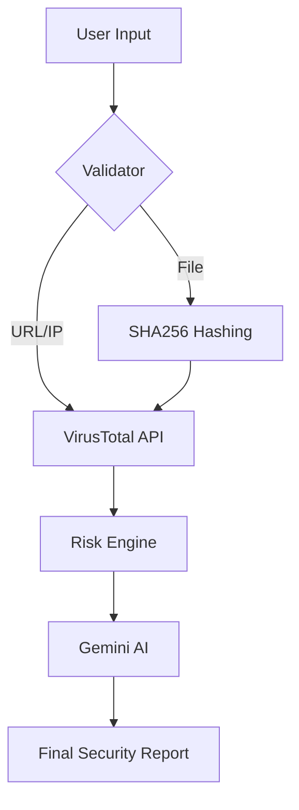

# 🛡️ AI-Powered Security Assessment Tool

[](https://www.python.org/)
[](https://streamlit.io/)
[](https://www.virustotal.com/)
[](https://ai.google.dev/)

> **A professional-grade cybersecurity dashboard** that simplifies complex threat intelligence into human-readable reports using the power of AI.

---

## 🔗 Live Demo
Access the hosted application here: **[https://safetytracker.streamlit.app/](https://safetytracker.streamlit.app/)**

---

## ✨ Key Capabilities

| Feature | Description |
| :--- | :--- |
| 🌐 **URL Scanner** | Checks website reputation against 70+ security vendors. |
| 📍 **IP Analysis** | Identifies malicious IP addresses and global threat origins. |
| 📄 **File Guard** | Generates SHA256 hashes for `.exe`, `.zip`, `.pdf` to detect known malware. |
| 🧠 **AI Reporting** | Converts technical logs into an executive summary with recommendations. |
| 📊 **Risk Engine** | Automatically calculates a risk score from **0 (Safe)** to **100 (Critical)**. |

---

## 🚀 How It Works

1.  **Input:** You provide a URL, IP, or File.
2.  **Scan:** The tool queries the **VirusTotal API** for real-time security data.
3.  **Analyze:** Our internal **Risk Engine** calculates the threat level.
4.  **Generate:** **Google Gemini AI** writes a professional security report for you.
5.  **Export:** Download the entire assessment as a **JSON report** for your records.

---

## 🛠️ Setup Instructions

### 1️⃣ Installation
```bash
# Clone the project
git clone https://github.com/harshith1118/saftey111.git

# Enter the directory
cd security_assessment_tool

# Install requirements
pip install -r requirements.txt
```

### 2️⃣ Configuration
Create a `.env` file in the root folder and add your API keys:
```env
VIRUSTOTAL_API_KEY=your_virustotal_key_here
GEMINI_API_KEY=your_gemini_key_here
```

### 3️⃣ Launch
```bash
streamlit run app.py
```

---

## ☁️ Deployment (Streamlit Cloud)
To deploy this app on Streamlit Cloud:
1.  **Push** your code to GitHub.
2.  Connect your repository to **[Streamlit Cloud](https://share.streamlit.io/)**.
3.  Add your API keys in the **Secrets** dashboard:
    ```toml
    VIRUSTOTAL_API_KEY = "your_key"
    GEMINI_API_KEY = "your_key"
    ```

---

## 📂 Project Architecture



---

## ⚠️ Disclaimer
*This tool is intended for security awareness and educational purposes. It utilizes external APIs and should be used as part of a broader security strategy.*

---
<p align="center">
  Built with precision by <b>Gemini CLI</b>
</p>
